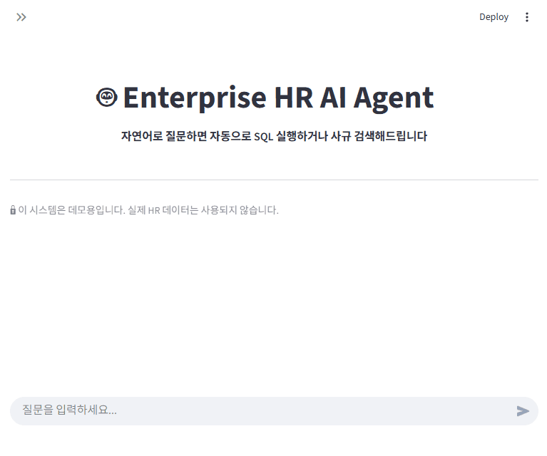

<div align="center">

# 🤖 Enterprise HR AI Agent

**자연어로 질문하면 자동으로 SQL 실행하거나 사규 검색해드립니다**

[](https://www.python.org/)
[](https://fastapi.tiangolo.com/)
[](https://www.langchain.com/)
[](https://www.docker.com/)



<details>
   <summary>이전 버전</summary>
      
</details>

</div>

---

## 🚀 Quick Start

```bash
# 1. 클론
git clone https://github.com/K-tuna/enterprise-hr-agent.git
cd enterprise-hr-agent

# 2. Ollama 설치 및 모델 다운로드
# https://ollama.com 에서 설치 후:
ollama pull qwen3:8b

# 3. 환경변수 설정 (Ollama 기본값)
echo "OLLAMA_HOST=http://localhost:11434" > .env

# 4. 실행 (Docker)
docker-compose up -d

# 5. OpenSearch 인덱스 빌드
python scripts/build_opensearch_index.py --rebuild

# 6. 접속
# API: http://localhost:8000/docs
# UI:  http://localhost:8501
```

---

## 🛤️ 개발 과정

| Phase | 작업 | 상세 |
|-------|------|------|
| 1 | 환경 구축 | Docker Compose (3개 서비스), MySQL 8.0 |
| 2 | SQL Agent | 자연어→SQL, Self-Correction 자동 재시도 |
| 3 | RAG Agent | 55,000자 PDF → 97 청크, FAISS Top-5 검색 |
| 4 | Router | LLM Few-shot 의도 분류, LangGraph 통합 |
| 5 | API | FastAPI 3-tier, Swagger 자동 문서화 |
| 6 | UI | Streamlit 채팅, Agent 타입 실시간 표시 |
| 7 | 리팩토링 | DI Container 패턴, 모듈 구조화 |

📝 [트러블슈팅 10건 해결](docs/troubleshooting/README.md)

---

## 🎯 핵심 차별점

### 1. **Self-Correction SQL Agent** ⚡
잘못된 SQL이 생성되어도 에러 메시지를 분석해 **자동으로 3번까지 재시도**
```
❌ 1차 시도: SELECT * FROM employee WHERE dept = 'Sales'
   → Error: Table 'employee' doesn't exist

✅ 2차 시도: SELECT * FROM employees WHERE dept_id = (SELECT dept_id FROM departments WHERE name = 'Sales')
   → Success!
```

### 2. **Router 기반 Multi-Agent** 🔀
질문 의도를 LLM이 자동 분석하여 **적절한 Agent로 분기**
- "직원 수는?" → SQL Agent
- "연차 규정은?" → RAG Agent
- Few-shot 프롬프트로 정확한 의도 분류

### 3. **100% 로컬 LLM** 🏠
API 비용 없이 **완전 오프라인** 실행 가능
- **Ollama + Qwen3:8B**: 로컬 추론
- **QLoRA 파인튜닝**: HR 도메인 특화 (qwen3-hr)
- **sentence-transformers**: 로컬 임베딩

### 4. **OpenSearch Hybrid Search** 🔍
BM25(Nori 한국어 분석기) + kNN 벡터 검색을 결합한 **네이티브 하이브리드 서치**
- **BM25 60% + kNN 40%** 최적 가중치 (Grid Search로 도출)
- **Recall 0.99** 달성 (RAGAS 평가)
- FAISS 대비 검색 품질 향상, `retriever_type` 설정으로 전환 가능

### 5. **현업 표준 아키텍처** 🏗️
- **LangGraph StateGraph**: 복잡한 플로우 선언적 구현
- **FastAPI 3-tier**: API/Service/Model 분리 (15개 파일)
- **OpenSearch 3.5**: 하이브리드 검색 (BM25 + kNN)
- **Docker Compose**: 원클릭 실행 환경

---

## 🏛️ 아키텍처

```
┌──────────┐      ┌───────────────┐      ┌─────────────────────────────────┐
│   User   │ ───▶ │  Streamlit UI │ ───▶ │         FastAPI Server          │
└──────────┘      └───────────────┘      │                                 │
                                         │  ┌───────────────────────────┐  │
                                         │  │   HRAgent (LangGraph)     │  │
                                         │  │                           │  │
                                         │  │   ┌───────────────────┐   │  │
                                         │  │   │  Router (LLM)     │   │  │
                                         │  │   │  "SQL or RAG?"    │   │  │
                                         │  │   └─────────┬─────────┘   │  │
                                         │  │             │             │  │
                                         │  │       ┌─────┴─────┐       │  │
                                         │  │       ▼           ▼       │  │
                                         │  │  ┌────────┐  ┌────────┐   │  │
                                         │  │  │  SQL   │  │  RAG   │   │  │
                                         │  │  │ Agent  │  │ Agent  │   │  │
                                         │  │  └────┬───┘  └────┬───┘   │  │
                                         │  └───────┼───────────┼───────┘  │
                                         └──────────┼───────────┼──────────┘
                                                    │           │
                                                    ▼           ▼
                                               ┌────────┐  ┌────────────┐
                                               │ MySQL  │  │ OpenSearch  │
                                               │   DB   │  │ BM25 + kNN │
                                               └────────┘  └────────────┘
```

---

## 🛠️ 기술 스택

| 카테고리 | 기술 | 선택 이유 |
|---------|------|----------|
| **LLM Framework** | LangChain 0.3.27 | LTS 지원 (2026.12까지), LCEL 스타일 |
| **Graph Engine** | LangGraph 0.2.60 | Self-Correction 루프 구현 필수 |
| **LLM** | Ollama + Qwen3:8B | 100% 로컬, API 비용 제로, 온프레미스 |
| **Fine-tuned** | qwen3-hr (QLoRA) | HR 도메인 특화 모델 |
| **Embedding** | sentence-transformers | 로컬 실행, 한글 지원 |
| **Search Engine** | OpenSearch 3.5 | BM25(Nori) + kNN 하이브리드 검색 |
| **Vector DB** | FAISS (fallback) | 무료, 로컬 실행, 빠름 |
| **Web Framework** | FastAPI | Async, 자동 문서화, 현업 표준 |
| **Frontend** | Streamlit | 빠른 프로토타이핑, Python only |
| **Database** | MySQL 8.0 | HR 시스템 업계 표준 |
| **Infra** | Docker Compose | 개발/배포 환경 일치 |

---

## 📡 API 엔드포인트

| Method | Endpoint | 설명 |
|--------|----------|------|
| GET | `/` | API 정보 |
| GET | `/api/v1/health` | 헬스 체크 |
| POST | `/api/v1/query` | HR 질의 처리 (핵심!) |
| GET | `/docs` | Swagger UI |
| GET | `/redoc` | ReDoc 문서 |

### POST /api/v1/query

**Request:**
```json
{
  "question": "개발팀 평균 급여는?"
}
```

**Response:**
```json
{
  "question": "개발팀 평균 급여는?",
  "answer": "7,250,000원",
  "agent_type": "SQL_AGENT",
  "success": true,
  "error": null
}
```

---

## 🎬 데모

### 📊 SQL Agent (Self-Correction)

**질문:** "영업팀 평균 급여 알려줘"

```
[1차 시도 실패]
SQL: SELECT AVG(salary) FROM employee WHERE dept = 'Sales'
Error: Table 'employee' doesn't exist

[2차 시도 성공] ✅
SQL: SELECT AVG(s.base_salary) 
     FROM salaries s 
     JOIN employees e ON s.emp_id = e.emp_id 
     JOIN departments d ON e.dept_id = d.dept_id 
     WHERE d.name = 'Sales'
     
Result: 6,500,000원
```

### 📚 RAG Agent (OpenSearch Hybrid Search)

**질문:** "육아휴직은 몇 개월까지 가능해?"

```
[OpenSearch Hybrid Search]
BM25(Nori): "육아휴직" 키워드 매칭
kNN: 의미적 유사도 벡터 검색
→ 가중 결합 (BM25 60% + kNN 40%) → Top 5 문서

[LLM 답변 생성]
"육아휴직은 최대 1년(12개월)까지 가능하며,
통상임금의 80%가 지급됩니다."

[참조 문서]
- 회사규정.pdf, 2.4절
```

### 🔀 Router (자동 분기)

| 질문 | 분류 결과 |
|------|----------|
| "김철수 연봉은?" | SQL_AGENT ✅ |
| "재택근무 규정은?" | RAG_AGENT ✅ |
| "부서별 직원 수는?" | SQL_AGENT ✅ |
| "복지 제도 알려줘" | RAG_AGENT ✅ |

Few-shot 프롬프트로 정확한 의도 분류

---

## 📁 프로젝트 구조

<details>
<summary>펼쳐보기</summary>

```
enterprise-hr-agent/
├── app/                          # FastAPI (3-tier 아키텍처)
│   ├── main.py
│   ├── core/                    # 설정 & 의존성
│   ├── models/                  # Pydantic 모델
│   ├── services/                # 비즈니스 로직
│   └── api/v1/endpoints/        # REST 엔드포인트
│
├── core/                         # Agent 핵심 로직
│   ├── agents/
│   │   ├── hr_agent.py          # 통합 Agent (LangGraph)
│   │   ├── sql_agent.py         # SQL Agent + Self-Correction
│   │   └── rag_agent.py         # RAG Agent (OpenSearch/FAISS)
│   ├── retrieval/
│   │   ├── opensearch_client.py # OpenSearch Hybrid Search 클라이언트
│   │   └── korean_bm25.py       # 한국어 BM25 (Kiwi 형태소 분석)
│   ├── database/
│   │   └── connection.py        # DB 연결 + 스키마 조회
│   ├── routing/
│   │   └── router.py            # 질문 의도 분류 (Few-shot)
│   ├── types/                   # 타입 정의
│   └── container.py             # DI Container
│
├── frontend/
│   └── app.py                   # Streamlit 채팅 UI
│
├── data/
│   ├── db_init/init.sql         # MySQL 스키마 + 더미 데이터 (15명)
│   ├── company_docs/            # 사규 문서 (PDF)
│   └── faiss_index/             # FAISS 벡터 인덱스 (fallback)
│
├── docker/
│   └── opensearch/Dockerfile    # OpenSearch 3.5 + Nori 플러그인
│
├── scripts/
│   ├── build_index.py           # FAISS 인덱스 빌드
│   └── build_opensearch_index.py # OpenSearch 인덱스 빌드
│
├── docker-compose.yml           # MySQL + API + OpenSearch + Streamlit
├── Dockerfile
└── requirements.txt
```

</details>

---

## 🔬 기술적 하이라이트

### 1. Self-Correction with LangGraph
```python
# 전통적인 방법 (단순 루프)
for attempt in range(3):
    sql = generate_sql(question)
    result, error = execute_sql(sql)
    if not error:
        break

# LangGraph 방식 (선언적)
workflow.add_conditional_edges(
    "execute",
    check_error,
    {
        "retry": "generate",  # 에러 시 재생성
        "end": END            # 성공 시 종료
    }
)
```

### 2. LCEL 스타일 (LangChain 0.3.x)
```python
# 체인 구성
chain = (
    {"context": retriever | format_docs, "question": RunnablePassthrough()}
    | prompt 
    | llm 
    | StrOutputParser()
)

# 실행
result = chain.invoke("연차는 몇일?")
```

### 3. Few-shot 프롬프트 (Router)
```python
template = """
<분류 예시>
질문: "직원은 총 몇 명인가요?" → SQL_AGENT
질문: "연차 규정 알려줘" → RAG_AGENT
질문: "개발팀 평균 급여는?" → SQL_AGENT
...

질문: {question}
분류:"""
```

### 4. RAG Retriever 비교 (RAGAS 평가)

| Retriever | Precision | Recall | Average |
|-----------|-----------|--------|---------|
| FAISS only | 0.8427 | 0.9500 | 0.8964 |
| BM25+FAISS (50/50) | 0.8717 | 0.9800 | 0.9259 |
| **OpenSearch Hybrid (60/40)** | **0.8392** | **0.9900** | **0.9146** |

> Grid Search로 BM25 60% + kNN 40% 최적 가중치 도출. Recall 0.99 달성.

#### 설정값

| 파라미터 | 설정값 | 근거 |
|---------|-------|------|
| **chunk_size** | 1,500자 | Chunking 최적화 실험 |
| **chunk_overlap** | 300자 (20%) | 문맥 연결 |
| **top_k** | 5 | Recall 0.99 달성 |
| **BM25 weight** | 0.6 | Grid Search 최적값 |
| **kNN weight** | 0.4 | Grid Search 최적값 |
| **embedding** | snowflake-arctic-embed-l-v2.0-ko (1024d) | 한국어 특화 |

---


## 🎯 핵심 기능 상세

### SQL Agent
- ✅ 자연어 → SQL 자동 생성
- ✅ 스키마 자동 인식
- ✅ Self-Correction (최대 3회)
- ✅ 복잡한 JOIN/GROUP BY 지원
- ✅ 에러 메시지 기반 수정

### RAG Agent
- ✅ PDF 문서 로드 (PDFPlumber)
- ✅ RecursiveCharacterTextSplitter (chunk_size=1500, overlap=300)
- ✅ 로컬 임베딩 (snowflake-arctic-embed-l-v2.0-ko, 1024d)
- ✅ **OpenSearch Hybrid Search** (BM25 Nori + kNN, 가중치 0.6/0.4)
- ✅ FAISS fallback 지원 (`RAG_RETRIEVER_TYPE=faiss`)
- ✅ RAGAS 기반 파라미터 최적화 (Recall 0.99)
- ✅ 참조 문서 출처 제공

### Router
- ✅ LLM 기반 의도 분류
- ✅ Few-shot 프롬프트 (8개 예시)
- ✅ 안전한 폴백 (불확실 시 RAG)

---

## 🗺️ Roadmap

| Version | Focus | Key Features |
|---------|-------|--------------|
| **v1.0** ✅ | 기본 완성 | SQL Agent, RAG Agent, Router |
| **v1.5** ✅ | 로컬 LLM | OpenAI → Ollama/Qwen3 전환, 파인튜닝 (qwen3-hr) |
| **v2.0** ✅ | 2025 현업 표준 | OpenSearch Hybrid Search (BM25+kNN), RAGAS 평가 |
| v2.1 | 모니터링 | LangSmith 트레이싱, RAGAS 평가 |
| v2.2 | 보안 | PII 마스킹, SQL Validation |

👉 [Phase 2 상세](docs/phase2/phase2_prd.md)

